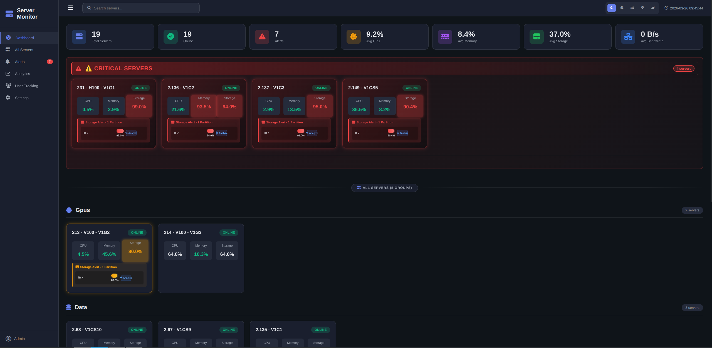
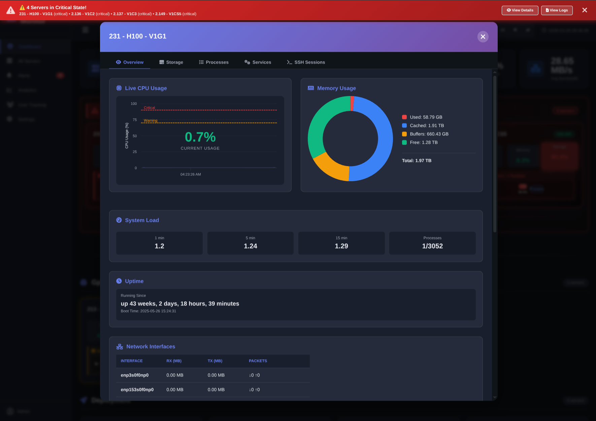
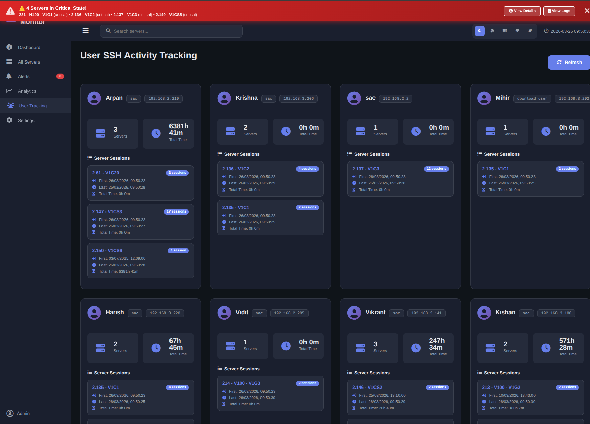
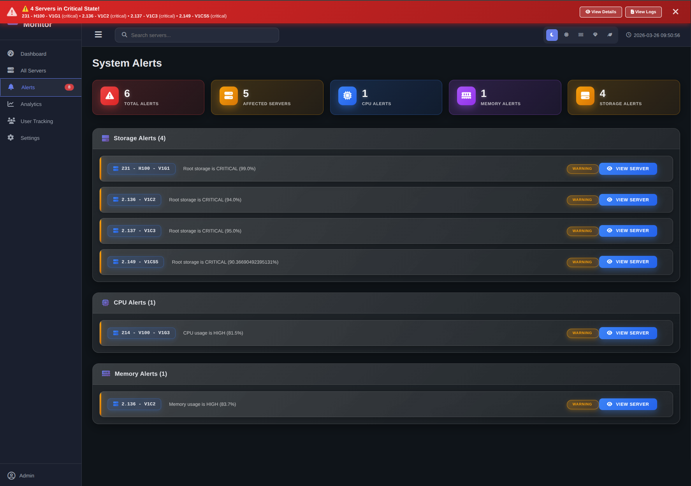
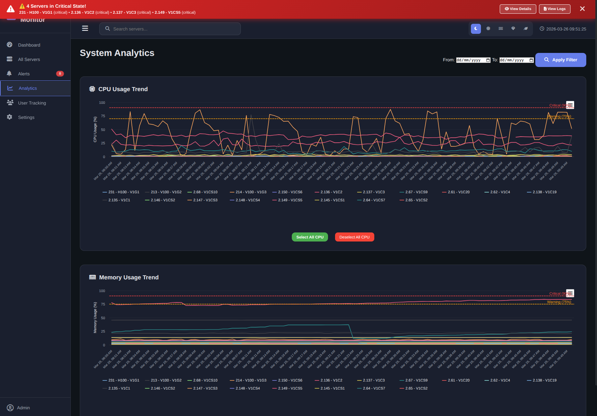

# 🖥️ Server Monitoring Dashboard

A real-time server monitoring and SSH user tracking dashboard built with **Flask** (Python) and **Vanilla JavaScript**. Designed for monitoring multiple Linux servers over SSH with live metrics, alerting, user session tracking, and storage analysis.

---

## 📸 Screenshots

### Dashboard Overview



### Server Details



### User Tracking



### Alerts



### Analytics



---

## ✨ Features

### 📊 Real-Time Monitoring

- Live **CPU**, **Memory**, and **Storage** usage per server
- Auto-refresh every 5 seconds (configurable)
- Color-coded status badges (`online`, `offline`, `error`)
- Warning/Critical threshold alerts with blinking indicators

### 👥 SSH User Tracking

- Tracks **who is connected** to which server
- Captures **actual login times** from the `who` command (not polling time)
- Calculates **total time spent** per user per server
- IP-to-Name mapping for friendly display names
- Filters out server-to-server SSH and console/display sessions (`:0`, `:1`)
- Background thread collects sessions every 30 seconds

### 🚨 Alert System

- Real-time alerts for CPU, Memory, Storage, and Offline servers
- **Warning** and **Critical** severity levels
- WebSocket-based push notifications
- Alert trends and history

### 📈 Analytics

- Historical CPU and Memory charts (Highcharts)
- Per-server comparison charts
- Server health scores
- 24-hour detailed history (288 data points)

### 🗂️ Storage Analysis

- Detailed per-partition storage breakdown
- Deep storage analysis — top 20 largest files and directories
- File type distribution
- Directory summary (Level 1)

### 🔧 Server Management

- View **running services** and **failed services**
- View **top CPU and Memory processes**
- **Kick SSH users** (terminate their session)
- View **journalctl logs** directly from the dashboard
- Network interface stats, uptime, and load average

### 🎨 UI/UX

- Multiple **themes** (Dark, Light, etc.)
- Compact view toggle
- Responsive sidebar navigation
- Smooth animations and transitions

---

## 🏗️ Project Structure

Below is the core directory structure for the server monitoring application:

```text
server_monitoring/
│
├── app/
│   ├── __init__.py      ← Flask app factory + background thread start
│   ├── routes.py        ← All API routes and SSH logic
│   └── alert_push.py    ← WebSocket alert pusher
│
├── static/
│   ├── css/
│   │   └── style.css    ← All styles + themes
│   └── js/
│       ├── monitor.js   ← Main frontend logic
│       └── lib/         ← Highcharts, Chart.js, etc.
│
├── templates/
│   └── index.html       ← Single-page app template
│
├── config.py            ← Server list and SSH credentials
├── database.py          ← SQLite DB for analytics history
├── run.py               ← App entry point
├── user_tracking.json   ← Auto-generated SSH session store
└── requirements.txt
```

## ⚙️ Configuration

Edit `config.py` to add your servers:

```python
class Config:
    SERVER_GROUPS = {
        "gpu": [
            {
                "name": "23 - H100 - V1G1",
                "ip": "192.168.1.23",
                "username": "your_user",
                "password": "your_password",
                "group": "gpus"
            },
            # Add more servers...
        ]
    }

    # Flatten all servers into a single list
    SERVERS = [s for group in SERVER_GROUPS.values() for s in group]
```

Edit **IP to Name mapping** in `monitor.js`:

```javascript
const IP_NAME_MAP = {
  "192.168.1.22": "user1",
  "192.168.1.14": "user2",
  "192.168.1.22": "user3",
  "192.168.1.20": "user4",
  "192.168.1.21": "user5",
  // Add more...
};
```

---

## 🚀 Installation

### 1. Clone the Repository

```bash
git clone https://github.com/yourusername/server-monitoring.git
cd server-monitoring
```

### 2. Create Virtual Environment

```bash
python3 -m venv flask_env
source flask_env/bin/activate   # Linux/Mac
flask_env\Scripts\activate      # Windows
```

### 3. Install Dependencies

```bash
pip install -r requirements.txt
```

### 4. Install `sshpass` (required for SSH commands)

```bash
sudo apt install sshpass       # Ubuntu/Debian
sudo yum install sshpass       # RHEL/CentOS
```

### 5. Configure Servers

Edit `config.py` with your server details (IPs, credentials, groups).

### 6. Run the Application

```bash
python run.py
```

Open your browser at: `http://127.0.0.1:5011/monitoring_server/home`

---

## 📦 Requirements

```txt
flask
flask-socketio
paramiko
sshpass (system package)
```

Full `requirements.txt`:

```txt
flask>=2.3.0
flask-socketio>=5.3.0
paramiko>=3.0.0
eventlet>=0.33.0
```

---

## 🔌 API Endpoints

| Method | Endpoint                   | Description                       |
| ------ | -------------------------- | --------------------------------- |
| `GET`  | `/api/status`              | All server statuses (cached)      |
| `POST` | `/api/live_metrics`        | Live metrics for selected servers |
| `GET`  | `/api/alerts`              | Current alerts                    |
| `GET`  | `/api/user_tracking`       | SSH user tracking data            |
| `GET`  | `/api/debug/tracking`      | Raw tracking JSON (debug)         |
| `POST` | `/api/server_logs`         | Fetch journalctl logs             |
| `POST` | `/api/kick_ssh`            | Terminate SSH user session        |
| `POST` | `/api/user_services`       | Active processes per user         |
| `POST` | `/api/analyze_storage`     | Deep storage analysis             |
| `GET`  | `/api/server_health_score` | Server health scores              |
| `GET`  | `/api/alert_trends`        | Alert trend history               |
| `GET`  | `/api/server_comparison`   | Cross-server metric comparison    |
| `GET`  | `/api/test/who/<server>`   | Debug `who` command output        |

---

## 🔄 Background Thread

The app starts a background thread on launch that:

1. SSHs into each server every **30 seconds**
2. Runs the `who` command to get active sessions with **actual login times**
3. Updates `user_tracking.json` with session data
4. Marks sessions as ended if no longer in `who` output

```python
# run.py
tracking_thread = threading.Thread(target=collect_server_data, daemon=True)
tracking_thread.start()
```

---

# 🛡️ SSH User Tracking Dashboard

A real-time server monitoring application that tracks active SSH user sessions across multiple Linux servers. Built with Flask and WebSockets, this tool provides a live dashboard to monitor who is logged in, their session durations, and their client IPs.

## ✨ Features

- **Real-Time Tracking:** Parses live session data directly from the servers using native Linux commands.
- **Live Dashboard:** Single-page web interface built with modern chart libraries (Chart.js/Highcharts) to visualize server traffic.
- **WebSocket Alerts:** Pushes immediate notifications to the frontend when a new user logs in or a session drops.
- **Analytics History:** Logs all session data into a local SQLite database for historical reporting and auditing.
- **Multi-Server Support:** Monitor multiple nodes concurrently from a centralized `config.py` file.

## ⚙️ How It Works

The tracker runs the Linux `who` command on each server and parses real login times:

```text
$ who
sac       pts/1     2026-02-10 11:08  (192.168.3.208)
│         │         │                 │
│         │         │                 └─ Client IP (user's machine)
│         │         └─ Actual login time (not poll time)
│         └─ Terminal
└─ Username

{
  "login_time":  "2026-02-10T11:08:00",
  "first_seen":  "2026-02-10T11:08:00",
  "last_seen":   "2026-02-10T17:30:00",
  "terminal":    "pts/1",
  "logout_time": null
}

```

**Filtered out:**

- Server-to-server SSH (e.g., `192.168.1.13` connecting to another server)
- Local display sessions (`:0`, `:1`, `:pts/9:S.0`)

---

## 📊 Thresholds (Configurable in `routes.py`)

| Metric         | Warning | Critical |
| -------------- | ------- | -------- |
| CPU            | 75%     | 90%      |
| Memory         | 75%     | 90%      |
| Storage (root) | 80%     | 90%      |

---

## 🤝 Contributing

1. Fork the repository
2. Create your feature branch: `git checkout -b feature/my-feature`
3. Commit your changes: `git commit -m 'Add my feature'`
4. Push to the branch: `git push origin feature/my-feature`
5. Open a Pull Request

---

## 📄 License

This project is licensed under the MIT License - see the [LICENSE](LICENSE) file for details.

---

<br>

<div align="center">
  <h2>👨‍💻 Author</h2>
  <p>
    <b>Mihir Bulsara</b><br>
    <i>Vedas / SAC Monitoring Team</i>
  </p>
  <p>
    Built for internal GPU & compute server monitoring at<br>
    <b>SAC (Space Applications Centre)</b>
  </p>
</div>

<br>

## ⭐ Acknowledgements

- [Flask](https://flask.palletsprojects.com/)
- [Highcharts](https://www.highcharts.com/)
- [Chart.js](https://www.chartjs.org/)
- [Paramiko](https://www.paramiko.org/)
- [Font Awesome](https://fontawesome.com/)

```
